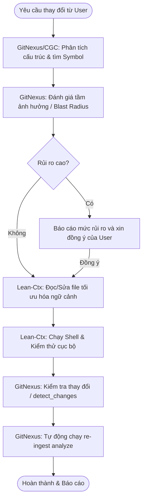
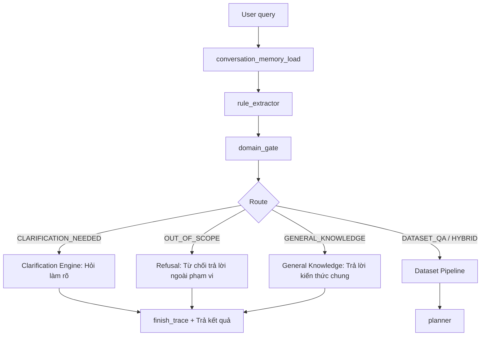
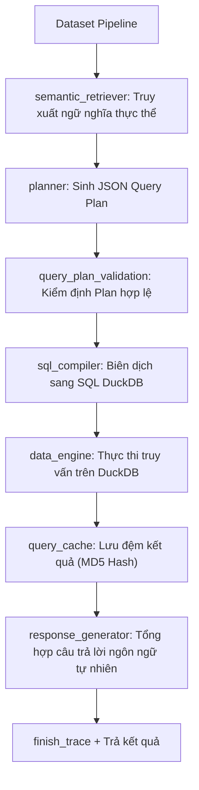

# Cấu Trúc Dự Án & Hướng Dẫn Vận Hành Tích Hợp (PROJECT STRUCTURE & WORKFLOW)

Dự án này tập trung vào việc xây dựng Chatbot thông minh (RAG) và hệ thống tự động hóa báo cáo phân tích diễn biến hộ nghèo, hộ cận nghèo (2023-2024) dựa trên dữ liệu khảo sát tại tỉnh Đắk Nông, hỗ trợ truy vấn thông tin và xuất báo cáo theo 15 biểu mẫu chuẩn của Chính phủ.

Tài liệu này là **bản đồ hướng dẫn** duy nhất mô tả cấu trúc thư mục, luồng xử lý và cách thức phối hợp công cụ cho nhà phát triển và các AI Agent.

---

## 1. Cấu Trúc Thư Mục Dự Án (Directory Tree & Roles)

Dưới đây là sơ đồ cấu trúc thư mục vật lý thực tế sau khi đã tối ưu hóa, loại bỏ các file trùng lặp và phân nhóm rõ ràng:

```text
📁 Intern/ (Thư mục gốc của project)
├── 📄 requirements.txt                 <-- Khai báo thư viện Python cần thiết (LangChain, DuckDB, Qdrant, v.v.)
├── 📄 .env                             <-- Lưu trữ thông tin kết nối và API Keys bảo mật
├── 📄 .gitignore                       <-- Quản lý các file và thư mục bỏ qua không đẩy lên Git
├── 📄 PROJECT_STRUCTURE.md             <-- File này (Tài liệu cấu trúc, sơ đồ và trạng thái dự án)
├── 📄 AGENTS.md                        <-- Chỉ dẫn phối hợp công cụ cho AI Agent (GitNexus & Lean-Ctx)
├── 📄 CLAUDE.md                        <-- Bộ nhớ phiên và chỉ dẫn vận hành cục bộ
├── 📁 .agents/                         <-- Chứa tài liệu định hướng và cấu hình nội bộ của AI Agent
│   ├── 📁 rules/                       
│   │   ├── 📄 project_rules.md         <-- Quy tắc phát triển dự án bắt buộc (10 quy tắc vàng)
│   │   └── 📄 claude-mem-context.md    <-- Ngữ cảnh bộ nhớ xuyên suốt các session
│   └── 📁 skills/                      <-- Các bộ kỹ năng hành vi (Skills) tự cấu hình của Agent
│
├── 📁 app/                             <-- Thư mục chứa giao diện người dùng
│   └── 📄 streamlit_chatbot.py         <-- Ứng dụng giao diện Chatbot Q&A bằng Streamlit
│
├── 📁 data/                            <-- Thư mục tập trung toàn bộ tài nguyên dữ liệu
│   ├── 📁 raw/                         <-- Dữ liệu khảo sát thô ban đầu
│   │   ├── 📁 2023/                    <-- File Excel thô 8 huyện/thị năm 2023
│   │   └── 📁 2024/                    <-- File Excel thô 8 huyện/thị năm 2024
│   └── 📁 Processed/                   <-- Dữ liệu đã được làm sạch và chuẩn hóa qua Pipeline
│       ├── 📁 2023/                    <-- Dữ liệu hộ gia đình và thành viên đã xử lý (năm 2023)
│       ├── 📁 2024/                    <-- Dữ liệu hộ gia đình và thành viên đã xử lý (năm 2024)
│       ├── 📁 metadata/                <-- Các file metadata tự sinh phục vụ định tuyến và cấu hình
│       │   ├── 📄 data_dictionary.json <-- Định nghĩa kiểu dữ liệu và mô tả các cột trong Database
│       │   ├── 📄 report_schema_summary.json <-- Tóm tắt cấu trúc của 15 mẫu báo cáo Excel
│       │   └── 📁 query_control/       <-- Metadata cấu hình chi tiết cho chatbot Q&A
│       │       ├── 📄 semantic_layer.json <-- Khớp cột vật lý với thuật ngữ nghiệp vụ (Dimensions, Measures)
│       │       ├── 📄 schema_graph.json    <-- Đồ thị liên kết quan hệ thực thể phục vụ sinh SQL JOIN
│       │       └── ...
│       ├── 📁 logs/                    <-- Nhật ký xử lý dữ liệu và kiểm định logic
│       │   ├── 📄 processing_log.json  
│       │   └── 📊 validation_summary.xlsx <-- Log kết quả kiểm thử logic dữ liệu
│       └── 📄 intern_chatbot.duckdb    <-- Cơ sở dữ liệu phân tích nhúng DuckDB (Single Source of Truth)
│
├── 📁 src/                             <-- Thư mục chứa toàn bộ mã nguồn logic chính của dự án
│   ├── 📁 scripts/                     <-- Các script xử lý dữ liệu và vận hành hệ thống lõi
│   │   ├── 📄 pipeline.py              <-- Logic tiền xử lý, chuẩn hóa thô và trích xuất thuộc tính hộ nghèo
│   │   ├── 📄 process_all.py           <-- Trình điều phối chạy toàn bộ pipeline làm sạch và nạp dữ liệu
│   │   └── 📄 validate_processed_data.py <-- Script kiểm định tính hợp lệ của dữ liệu đầu ra
│   └── 📁 query_control/               <-- Các module xử lý truy vấn và điều khiển Chatbot Q&A
│       ├── 📄 domain_gate.py           <-- Bộ phân loại định tuyến câu hỏi (Dataset QA, Refusal, Clarification)
│       ├── 📄 query_planner.py         <-- Trình lập kế hoạch truy vấn sinh JSON Query Plan dựa trên LLM + Rules
│       ├── 📄 sql_compiler.py          <-- Biên dịch JSON Query Plan thành câu truy vấn SQL DuckDB chuẩn
│       ├── 📄 data_engine.py           <-- Thực thi SQL an toàn trên DuckDB (Giới hạn số dòng, chống SQL Injection)
│       ├── 📄 query_cache.py           <-- Bộ đệm kết quả truy vấn dựa trên MD5 Hash
│       ├── 📄 semantic_retriever.py    <-- Truy xuất ngữ nghĩa từ Qdrant Vector DB để gán nhãn thực thể
│       ├── 📄 build_schema_graph.py    <-- Tự động sinh file schema_graph.json
│       ├── 📄 build_semantic_layer.py  <-- Tự động sinh file semantic_layer.json
│       ├── 📄 build_qdrant_semantic_index.py <-- Nạp định nghĩa nghiệp vụ vào Qdrant
│       ├── 📄 clarification_engine.py  <-- Phát hiện thiếu thông tin và sinh câu hỏi phản hồi làm rõ
│       └── 📄 observability.py         <-- Nhật ký trace log, đo đạc latency của từng stage
│
├── 📁 run_server/                      <-- Cấu hình và hướng dẫn triển khai Gemma Server chạy local/Docker
│   ├── 📄 entrypoint.sh                
│   ├── 📄 quick_setup.txt              
│   └── 📄 walkthrough.md               
│
└── 📁 test/                            <-- Thư mục tập trung các kịch bản kiểm thử, kiểm định dữ liệu và gỡ lỗi
    ├── 📁 debug/                       <-- Các script phục vụ debug nhanh và phân tích log
    │   ├── 📄 watch_gitnexus.py        <-- Script tự động quét thay đổi và chạy re-ingest Graph
    │   ├── 📄 check_db_values.py       
    │   ├── 📄 inspect_schema.py        
    │   └── ...
    ├── 📁 golden_questions/            <-- Bộ câu hỏi kiểm thử chuẩn (Golden Questions) và báo cáo đánh giá
    │   ├── 📄 golden_questions_30.csv  
    │   └── 📄 evaluation_report.md     
    ├── 📁 planning_eval/               <-- Đánh giá hiệu quả của LLM Planner
    │   ├── 📄 run_llm_eval.py          
    │   └── 📁 results/                 
    ├── 📁 scripts/                     <-- Mã nguồn hỗ trợ quá trình kiểm thử
    │   ├── 📄 generate_golden_questions.py 
    │   └── 📄 evaluate_chatbot_against_golden.py
    └── 📓 query.ipynb                  <-- Notebook chứa 5 câu truy vấn phân tích DuckDB mẫu
```

---

## 2. Thiết Lập Workflow Tích Hợp (GitNexus + CodeGraphContext + Lean-Ctx)

Dự án áp dụng mô hình phân chia trách nhiệm rõ ràng cho AI Agent để tối ưu hóa token và đảm bảo an toàn mã nguồn:

1.  **GitNexus (Kiến trúc & Blast Radius):** Phân tích luồng thực thi (`processes`), tìm kiếm ký hiệu nâng cao, đánh giá tầm ảnh hưởng khi thay đổi (`impact`) và kiểm tra các thay đổi trước khi commit (`detect_changes`).
2.  **CodeGraphContext (Ký hiệu & Quan hệ sâu):** Phân tích callers/callees chi tiết, tính toán độ phức tạp hàm (`calculate_cyclomatic_complexity`), phát hiện mã nguồn chết (`find_dead_code`).
3.  **Lean-Ctx (Thực thi vật lý tối ưu):** Đọc/sửa file cục bộ có nén (`ctx_read`), thực thi lệnh shell nén kết quả (`ctx_shell`).



---

## 3. Sơ đồ Luồng Xử Lý Thực Tế Của Chatbot (Chatbot Pipeline Flow)

Sơ đồ này mô tả chi tiết đường đi của một truy vấn khi đi qua `ChatbotAnswerEngine.answer()`:

### 3.1. Phân loại định tuyến câu hỏi (Stage 1)


### 3.2. Tiến trình xử lý truy vấn dữ liệu (Stage 2)


---

## 4. Bản Đồ File & Vị Trí Chức Năng Cốt Lõi

Khi cần sửa đổi một chức năng cụ thể, nhà phát triển/Agent có thể đối chiếu nhanh với bảng sau:

| Chức Năng Cần Thay Đổi | Đường Dẫn File Vật Lý | Hàm / Class Cụ Thể | Ghi Chú |
| :--- | :--- | :--- | :--- |
| **Logic làm sạch dữ liệu thô** | `src/scripts/pipeline.py` | `normalize_raw_core_values` | Chuẩn hóa tên xã/huyện, xử lý giá trị khuyết. |
| **Logic sinh chỉ số nghèo đa chiều** | `src/scripts/pipeline.py` | `generate_household_features` | Tính toán điểm thiếu hụt các dịch vụ xã hội cơ bản. |
| **Phân loại câu hỏi đầu vào** | `src/query_control/domain_gate.py` | `DomainGate.classify` | Phân tuyến câu hỏi giữa dữ liệu và kiến thức chung. |
| **Tinh chỉnh Prompt Planner** | `data/Processed/metadata/query_control/planner_prompt.md` | Toàn bộ nội dung | Cung cấp ngữ cảnh cột và hướng dẫn lập plan cho LLM. |
| **Biên dịch kế hoạch sang SQL** | `src/query_control/sql_compiler.py` | `SQLCompiler.compile` | Xử lý ánh xạ cột, xử lý lọc chính xác các từ đặc thù. |
| **Cấu hình kết nối DuckDB** | `data/Processed/metadata/query_control/duckdb_config.json` | Toàn bộ nội dung | Chứa cấu hình kết nối DB vật lý và đường dẫn parquet. |

---

## 5. Trạng Thái Hiện Tại Của Dự Án

*   **Đã hoàn thành cấu trúc lại (Folder Refactoring):**
    *   Toàn bộ dữ liệu (thô, đã xử lý, DuckDB, metadata) được di chuyển vào thư mục cha tập trung `data/`.
    *   Mã nguồn chính được gộp vào `src/` (với `src/scripts/` và `src/query_control/`).
    *   Tất cả các script kiểm thử, đánh giá và debug được gom vào `test/` (với `test/debug/` chứa các tệp tin hỗ trợ).
*   **Thắt chặt quy chế Agent (Governance Rules):**
    *   Bổ sung cơ chế **Consent-First** (Quy tắc 7): Agent tuyệt đối không tự ý chạy code/kiểm thử hoặc sửa các file nằm ngoài phạm vi yêu cầu trực tiếp trong prompt của User khi chưa được đồng ý.
    *   Bổ sung cơ chế **Tự động Re-ingest Graph** (Quy tắc 10): Tích hợp script `test/debug/watch_gitnexus.py` hỗ trợ lập chỉ mục tự động khi có thay đổi tệp tin cục bộ, đồng thời Agent tự chạy `npx gitnexus analyze` sau khi chỉnh sửa file.
    *   Bổ sung cơ chế **Quy trình Xem Code & Q&A Tối Ưu (Quy tắc 11):** Thiết kế lại workflow cho các tác vụ Read-Only thuần túy (không sửa đổi hay chạy code) nhằm loại bỏ hoàn toàn các API/MCP calls dư thừa (chạy test, impact analysis, detect changes, re-ingest graph) và giới hạn tối đa số lần tìm kiếm/đọc tệp tin để tiết kiệm API call.
*   **Tích hợp Meta-Tools & Smart Hints (Hiệu Năng Toàn Diện):**
    *   Triển khai server trung gian `src/scripts/meta_mcp_server.py` để gộp các MCP servers con (GitNexus, CodeGraphContext, Lean-Ctx) và cung cấp meta-tool `meta_deep_context`.
    *   Xây dựng Meta-Tool `meta_deep_context` trả về tổng quan symbol (context, dependencies, impact) chỉ trong một lượt gọi duy nhất.
    *   Tích hợp cơ chế tự động tiêm gợi ý thông minh (`_agent_hint` / `Smart Hints`) vào tất cả kết quả trả về của các công cụ, giúp định hướng hành động tiếp theo và giảm tối đa số lần gọi API dư thừa.
    *   **Khắc phục hiệu năng & ổn định hệ thống MCP:**
        *   Sửa lỗi treo/timeout của server `sequential-thinking` trên Windows bằng cách chuyển cấu hình trong `mcp_config.json` từ sử dụng `npx` (gây chậm trễ khởi động do tải package) sang gọi trực tiếp package cài đặt toàn cục thông qua `node`.
        *   Khắc phục hoàn toàn lỗi khóa nghẽn (deadlock) luồng stdio của `meta_mcp_server.py` trên Windows bằng cách thay thế cơ chế đọc/ghi `sys.stdin`/`sys.stdout` đồng bộ khóa chéo bằng thread đọc thô `os.read(0, ...)` và ghi thô `os.write(1, ...)` bất đồng bộ qua Queue.
        *   Thêm cơ chế tự động hủy tác vụ (timeout) sau 5 giây cho yêu cầu lấy danh sách công cụ (`tools/list`) và 30 giây cho yêu cầu gọi công cụ (`tools/call`) nhằm loại bỏ tình trạng đơ/treo vô hạn khi có child process bị dừng đột ngột.
        *   Sửa lỗi giải mã dữ liệu (`UnicodeDecodeError`) của child process khi đọc logs/stderr chứa ký tự đặc biệt tiếng Việt bằng cách cấu hình giải mã `utf-8` với chế độ `errors="replace"`.
*   **Dọn dẹp thư mục gốc (Root Clean-up):**
    *   Di chuyển file `skills-lock.json` vào thư mục cấu hình Agent `.agents/skills-lock.json`.
    *   Di chuyển file `test_traces.json` (chứa nhật ký dấu vết thực thi thử nghiệm) vào thư mục `test/test_traces.json`.


