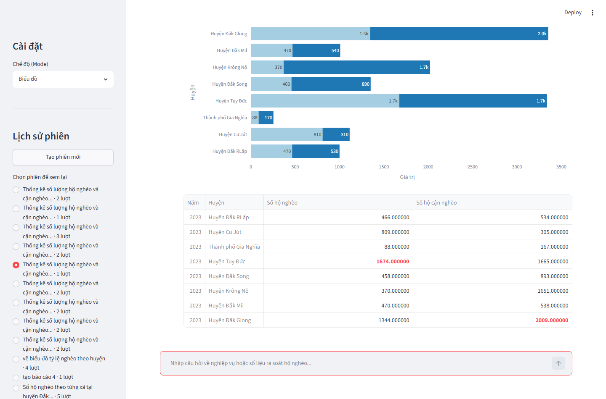
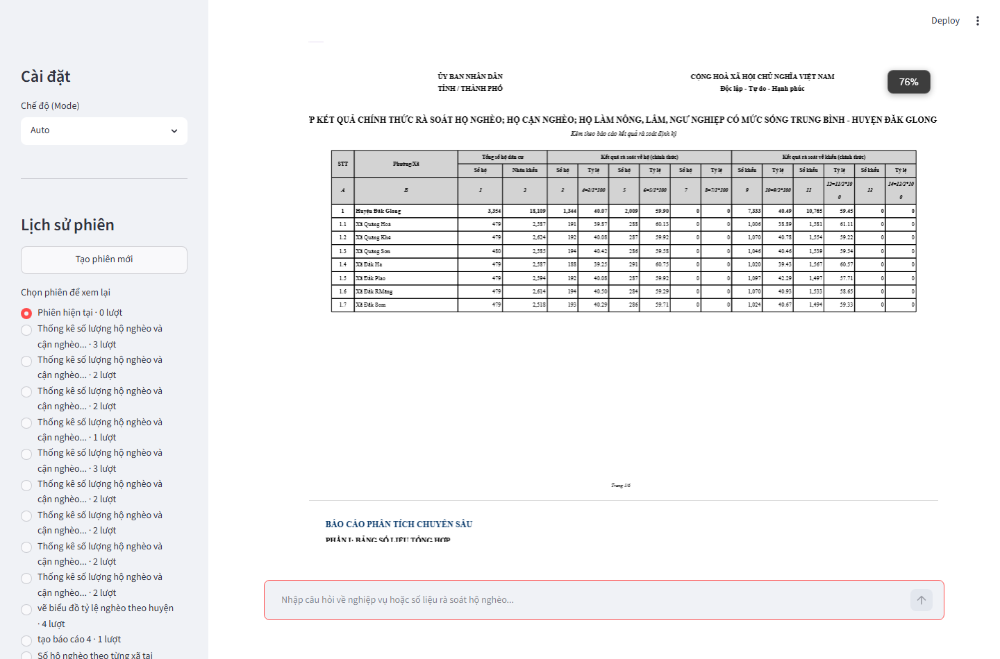

<div align="center">

# 🏛️ HỆ THỐNG TRỢ LÝ ẢO AI - RÀ SOÁT & PHÂN TÍCH HỘ NGHÈO ĐẮK NÔNG
### *(RAG & Agentic Multi-Route Pipeline for Poverty Analysis in Dak Nong Province)*

[](https://www.python.org/)
[](https://streamlit.io/)
[](https://python.langchain.com/)
[](https://duckdb.org/)
[](https://qdrant.tech/)
[](https://plotly.com/)
[](https://opensource.org/licenses/MIT)

---

**Trợ lý Ảo AI hiện đại thông minh hỗ trợ Cán bộ & Nhà quản lý rà soát, truy vấn phức tạp, tạo biểu đồ động và tự động sinh báo cáo tổng hợp đa chiều về thực trạng hộ nghèo/cận nghèo tại tỉnh Đắk Nông.**

</div>

---

## 🌟 Tổng quan Hệ thống (System Overview)

Dự án ứng dụng kiến trúc **Agentic Multi-Route Pipeline** kết hợp giữa **Retrieval-Augmented Generation (RAG)**, **DuckDB SQL Engine** tốc độ cao và **Qdrant Vector Search**. Hệ thống tự động phân loại ý định (Intent Classification) của người dùng để điều hướng truy vấn qua 3 luồng xử lý chuyên sâu:

1. 💬 **Hỏi - Đáp Phức tạp (Complex Q&A / Route 1)**: Tra cứu siêu tốc thông tin từng hộ nghèo, thống kê các chiều thiếu hụt, tự động chuyển đổi ngôn ngữ tự nhiên thành câu lệnh SQL chuẩn xác (Text-to-SQL) trên `DuckDB`.
2. 📊 **Vẽ Biểu đồ Tương tác (Dynamic Charting / Route 2)**: Tự động phân tích yêu cầu thống kê, trích xuất dữ liệu và sinh mã `Plotly` tạo các biểu đồ trực quan (cột, tròn, đường, heatmap...) ngay trên giao diện.
3. 📑 **Sinh Báo cáo Tổng hợp (Comprehensive Reporting / Route 3)**: Tự động tổng hợp dữ liệu, phân tích các nguyên nhân nghèo, cấu trúc dân tộc, tỷ lệ thoát nghèo và xuất báo cáo hành chính chuẩn xác đa chiều.

---

## 📸 Giao diện Thực tế (UI Screenshots)

Dưới đây là hình ảnh giao diện thực tế của hệ thống khi hoạt động (được chụp tự động bằng Playwright):

### 1. Giao diện Hỏi - Đáp Tổng quan (Complex Q&A Dashboard)
Trợ lý ảo xử lý câu hỏi phức tạp bằng ngôn ngữ tự nhiên, kết hợp ngữ cảnh RAG và truy vấn dữ liệu thực tế:
<p align="center">
  
</p>

---

### 2. Giao diện Vẽ Biểu đồ Động (Dynamic Chart Mode)
Hệ thống tự động sinh biểu đồ tương tác Plotly đa dạng dựa theo yêu cầu thống kê tức thời của người dùng:
<p align="center">
  
</p>

---

### 3. Giao diện Sinh Báo cáo Hành chính (Comprehensive Report Mode)
Tự động tổng hợp số liệu rà soát, hiển thị cấu trúc chi tiết, nguyên nhân thiếu hụt và đánh giá giải pháp:
<p align="center">
  
</p>

---

## 🛠️ Hướng dẫn Cài đặt & Thiết lập (Quick Start)

### 1. Yêu cầu Hệ thống (Prerequisites)
- **Python**: Phiên bản `3.10` hoặc `3.11` (khuyến nghị).
- **Git**: Để sao chép mã nguồn.

### 2. Cài đặt Môi trường (Installation Steps)

**Bước 1: Clone repository về máy**
```bash
git clone https://github.com/CaoAnhNato/RAG_PoorHousehold.git
cd RAG_PoorHousehold
```

**Bước 2: Tạo và kích hoạt Virtual Environment**
```bash
# Trên Windows:
python -m venv venv
.\venv\Scripts\activate

# Trên macOS / Linux:
python3 -m venv venv
source venv/bin/activate
```

**Bước 3: Cài đặt các thư viện phụ thuộc (Dependencies)**
```bash
pip install --upgrade pip
pip install -r requirements.txt
```

---

### 3. Cấu hình Biến Môi trường (`.env`)

Tạo file cấu hình `.env` từ file mẫu `.env.example`:
```bash
# Trên Windows (PowerShell):
Copy-Item .env.example .env

# Trên macOS / Linux:
cp .env.example .env
```

Sau đó, mở file `.env` và tiến hành cấu hình theo các lưu ý quan trọng dưới đây:

> [!CAUTION]
> **⚠️ LƯU Ý BẮT BUỘC VỀ MODEL EMBEDDING (`EMBEDDING_MODEL`)**:
> - Bạn **BẮT BUỘC PHẢI GIỮ NGUYÊN** cấu hình `EMBEDDING_MODEL=AITeamVN/Vietnamese_Embedding`.
> - **Lý do**: Toàn bộ dữ liệu vector nhúng (Semantic Vector Database) của Đắk Nông đã được chuẩn hóa và xây dựng trên chiều vector & ngữ nghĩa tiếng Việt của mô hình `AITeamVN/Vietnamese_Embedding`. Nếu đổi sang model khác (như `OpenAI text-embedding-3`, `BGE`, v.v.), việc tìm kiếm ngữ nghĩa sẽ bị sai lệch hoàn toàn!

> [!NOTE]
> **💡 LƯU Ý VỀ MODEL LLM (TÙY Ý LỰA CHỌN)**:
> Ngược lại với Embedding, **Model LLM** (tạo lời giải, viết SQL, sinh mã biểu đồ) hoàn toàn **linh hoạt tùy theo nhu cầu và API Key bạn có**:
> - **OpenRouter / Compatible API**: Cấu hình `SHOPAPI_LLM_API_KEY`, `SHOPAPI_BASE_URL` (`https://openrouter.ai/api/v1`), và `SHOPAPI_MODEL_LLM=google/gemma-4-26b-a4b-it:free`.
> - **Google Gemini**: Cấu hình `GEMINI_API_KEY=AIzaSy...`.
> - **OpenAI gốc**: Cấu hình `OPENAI_API_KEY=sk-...`.

Ví dụ nội dung chuẩn file `.env`:
```env
# 1. EMBEDDING (BẮT BUỘC KHÔNG THAY ĐỔI)
EMBEDDING_MODEL=AITeamVN/Vietnamese_Embedding

# 2. VECTOR DATABASE
QDRANT_URL=http://localhost:6333

# 3. LLM PROVIDER (Ví dụ dùng OpenRouter / OpenAI compatible)
SHOPAPI_LLM_API_KEY=your_openrouter_api_key_here
SHOPAPI_BASE_URL=https://openrouter.ai/api/v1
SHOPAPI_MODEL_LLM=google/gemma-4-26b-a4b-it:free

# 4. DUCKDB DATABASE PATH
DUCKDB_PATH=Runtime/duckdb/poor_household.duckdb
```

---

## 🚀 Hướng dẫn Chạy Hệ thống (Usage)

### 1. Khởi chạy Giao diện Web Trợ lý Ảo (Streamlit UI) - Khuyến nghị
Chạy câu lệnh dưới đây để mở giao diện Web tương tác trực quan:
```bash
streamlit run app/streamlit_chatbot.py
```
Trình duyệt sẽ tự động mở tại địa chỉ: `http://localhost:8501`. Bạn có thể lựa chọn 1 trong 3 chế độ từ thanh công cụ bên trái:
- 💬 **Hỏi - Đáp**: Tra cứu thông tin chi tiết từng hộ, chỉ số nghèo...
- 📈 **Vẽ biểu đồ**: Sinh biểu đồ thống kê theo huyện, xã, chiều thiếu hụt...
- 📑 **Báo cáo tổng hợp**: Sinh báo cáo phân tích toàn diện.

### 2. Khởi chạy ở chế độ dòng lệnh CLI (Console MVP mode)
Nếu muốn test nhanh hoặc tích hợp qua terminal không cần giao diện Web:
```bash
python src/query_control/run_mvp_chatbot.py
```

---

## 💡 Câu hỏi Mẫu Thử nghiệm (Sample Queries)

Bạn có thể copy-paste các câu hỏi mẫu sau ngay khi khởi chạy hệ thống để trải nghiệm:

- **💬 Chế độ Hỏi - Đáp:**
  - *"Có bao nhiêu hộ nghèo tại huyện Đăk Glong trong năm 2023?"*
  - *"Liệt kê thông tin chủ hộ và địa chỉ của các hộ nghèo tại xã Đắk Wil, huyện Cư Jút."*
  - *"Hộ gia đình có mã số 12345 đang bị thiếu hụt những chỉ số nào về bảo hiểm y tế hoặc nước sạch?"*

- **📊 Chế độ Vẽ biểu đồ:**
  - *"Vẽ biểu đồ cột so sánh số lượng hộ nghèo và hộ cận nghèo giữa các huyện năm 2023."*
  - *"Tạo biểu đồ tròn thể hiện tỷ lệ các dân tộc của hộ nghèo tại huyện Krông Nô."*
  - *"Vẽ biểu đồ cột thể hiện số lượng hộ nghèo qua 2 năm 2023 - 2024 tại huyện Đăk Glong."*

- **📑 Chế độ Sinh Báo cáo:**
  - *"Tạo báo cáo tổng hợp thực trạng và nguyên nhân nghèo tại huyện Đắk Mil năm 2023."*
  - *"Xuất báo cáo đánh giá chỉ số thiếu hụt đa chiều về y tế và giáo dục toàn tỉnh Đắk Nông."*

---

## 📁 Cấu trúc Thư mục Dự án (Directory Structure)

```text
RAG_PoorHousehold/
├── app/
│   └── streamlit_chatbot.py          # Giao diện chính Streamlit UI Dashboard
├── src/
│   └── query_control/                # Core logic của Agentic Orchestrator & LLM helper
│       ├── agentic/                  # Multi-Route Pipeline (Q&A, Charting, Reporting, Guardrails)
│       ├── run_mvp_chatbot.py        # CLI interactive runner
│       └── build_qdrant_semantic_index.py # Script xây dựng chỉ mục vector nhúng
├── Runtime/                          # Thư mục lưu trữ database DuckDB & cache nhúng local
│   └── duckdb/
│       └── poor_household.duckdb     # Cơ sở dữ liệu DuckDB thô chính thức
├── docs/
│   └── images/                       # Hình ảnh chụp giao diện UI bằng Playwright
├── tests/                            # Bộ kiểm thử tự động UI & độ chính xác RAG
├── requirements.txt                  # Danh sách thư viện Python
├── .env.example                      # File cấu hình mẫu
└── README.md                         # Tài liệu hướng dẫn sử dụng (file này)
```

---

## 🤝 Ứng dụng & Phát triển (Contributing & License)

Dự án thuộc nghiên cứu & phát triển hệ thống trợ lý ảo thông minh cho quản lý hành chính công.  
Phát triển bởi: **CaoAnhNato & AI Engineering Team**  
Mọi đóng góp, báo cáo lỗi hoặc đề xuất tính năng xin vui lòng mở **Issue** hoặc **Pull Request** trên repository này.

<div align="center">
  <b>⭐️ Nếu bạn thấy hệ thống hữu ích, hãy để lại 1 Star cho Repository nhé! ⭐️</b>
</div>
