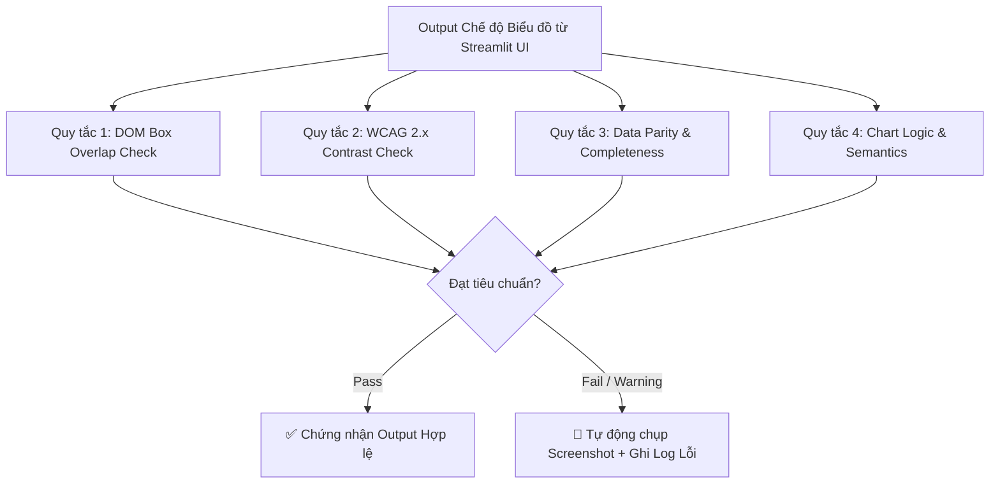

# TIÊU CHUẨN KIỂM ĐỊNH OUTPUT CHẾ ĐỘ BIỂU ĐỒ (UI CHART VALIDATION STANDARDS)

**Mã tài liệu:** `VAL-CHART-UI-001`  
**Dự án:** RAG_PoorHousehold (Streamlit Chatbot)  
**Phạm vi áp dụng:** Kiểm thử tự động Giao diện Người dùng (UI E2E Testing) cho chế độ **Biểu đồ (Chart Mode)** bằng Playwright & MCP Tools.  
**Tuân thủ quy trình:** @[/intent-orch]engine, @[.agents/rules/strict-follow.md], @[.agents/rules/project_rules.md]

---

## 1. MỤC TIÊU & NGUYÊN TẮC CHUNG

Tài liệu này xác định các tiêu chuẩn kỹ thuật và bộ quy tắc kiểm định bắt buộc đối với các biểu đồ (Plotly Chart) và bảng dữ liệu đi kèm được sinh ra trong chế độ **Biểu đồ** trên giao diện Streamlit.

### 1.1. Nguyên tắc cốt lõi (IntentOrch & Consent-First)
* **Khách quan & Không xâm lấn:** Quá trình kiểm định UI chỉ đánh giá dữ liệu hiển thị ở tầng ranh giới người dùng (`app/streamlit_chatbot.py`), tuyệt đối không tự ý sửa đổi logic core pipeline (`AgenticPipeline`, `SQLCompiler`, `DuckDBEngine`) khi chưa có sự đồng ý.
* **Tính ổn định hiển thị:** Biểu đồ hiển thị phải đẹp mắt (Rich Aesthetics), rõ ràng, không bị crash bởi lỗi phân giải dữ liệu (như lỗi mixed dtype của PyArrow hay lỗi đọc JSON của Pandas).
* **Tiêu chuẩn hiệu năng kiểm thử (Strict Rule 16):** Toàn bộ kịch bản kiểm thử thao tác trình duyệt qua Playwright (truy cập, chọn mode, gửi câu hỏi, chờ render, chụp ảnh, trích xuất DOM, xác minh) **bắt buộc phải đóng gói vào đúng 1 lần gọi tool duy nhất (Single-Call MCP)** nhằm tiết kiệm token và duy trì tính toàn vẹn ngữ cảnh.

---

## 2. BỘ 4 QUY TẮC KIỂM ĐỊNH CHUYÊN SÂU (DEEP VALIDATION RULES)

Khi tiến hành kiểm thử UI cho bất kỳ câu hỏi nào thuộc chế độ Biểu đồ (ví dụ: bộ 20 câu hỏi *Query Chart*), hệ thống kiểm thử bắt buộc phải tra soát và đánh giá qua 4 quy tắc chuyên sâu sau:



### Quy tắc 1: Kiểm tra Chồng chéo Nhãn văn bản (DOM Box Overlap Check)
* **Công cụ liên quan:** `visual_extract_dom_boxes`
* **Mục đích:** Ngăn chặn hiện tượng các nhãn trục (Axis Labels), chú thích (Legend), hoặc tiêu đề (Title) bị lồng ghép, chồng chéo lên nhau làm mất khả năng đọc.
* **Tiêu chuẩn kiểm định:**
  1. Trích xuất DOM Bounding Box ($X, Y, Width, Height$) của tất cả các phần tử text trong container `.stPlotlyChart`.
  2. **Trục X (X-Axis Labels):** Không được có bất kỳ 2 nhãn liền kề nào có vùng Bounding Box giao nhau (Intersection Area > 0). Đặc biệt với các biểu đồ thống kê theo địa phương (Huyện/Xã có tên dài).
  3. **Legend & Title:** Khung chú thích không được che khuất vùng vẽ dữ liệu chính (Plot Area).
* **Hành động khắc phục khi vi phạm:**
  * Yêu cầu tự động xoay nhãn trục X (`tickangle = -45` hoặc `-90`).
  * Nếu số lượng địa phương/nhãn $> 8$, ưu tiên chuyển hướng sang **Biểu đồ thanh ngang (Horizontal Bar Chart)**.

### Quy tắc 2: Kiểm tra Tương phản Màu sắc & Khả năng Tiếp cận (WCAG 2.x Contrast Check)
* **Công cụ liên quan:** `visual_check_wcag_contrast`
* **Mục đích:** Đảm bảo biểu đồ tuân thủ tiêu chuẩn tiếp cận thị giác quốc tế WCAG 2.x, thân thiện với mọi đối tượng người dùng (bao gồm chế độ Dark Mode / Light Mode).
* **Tiêu chuẩn kiểm định:**
  1. Tính toán tỷ lệ tương phản giữa màu chữ (`text_color`) và màu nền phía sau (`bg_color` / `paper_bgcolor` / `plot_bgcolor`).
  2. **Tiêu chuẩn tối thiểu (AA Level):**
     * Văn bản bình thường (Axis label, Tooltip, Legend text): Tỷ lệ tương phản tối thiểu **$\ge 4.5:1$**.
     * Tiêu đề lớn (Chart Title) hoặc thành phần đồ họa đậm: Tỷ lệ tương phản tối thiểu **$\ge 3.0:1$**.
  3. **Màu sắc bảng dữ liệu:** Bảng màu sử dụng trong các chuỗi dữ liệu (Data Series) phải hài hòa, phân biệt rõ ràng, tránh dùng các màu quá chói hoặc trùng lặp sắc độ trong biểu đồ tròn/cột cụm.

### Quy tắc 3: Kiểm tra Tính toàn vẹn & Đồng bộ Dữ liệu (Data Parity & Completeness Check)
* **Mục đích:** Đảm bảo "những gì hiển thị trên biểu đồ hoàn toàn khớp với dữ liệu thực tế từ backend", không bị mất mát, sai lệch hoặc hiển thị rỗng.
* **Tiêu chuẩn kiểm định:**
  1. **Khớp cấu trúc (Parity):** Dữ liệu truyền vào Plotly figure (`chart_fig.data[0].x`, `chart_fig.data[0].y`) phải tương ứng 1-1 với các cột và số liệu trong DataFrame đồng hành hiển thị bên dưới biểu đồ.
  2. **Tính đầy đủ (Completeness):**
     * Biểu đồ không được ở trạng thái rỗng (Empty Plot / No trace to render).
     * Không được chứa mảng toàn giá trị `NaN`, `Null`, hoặc `0` phi logic (trừ khi nghiệp vụ thực tế là 0).
  3. **Tính nhất quán văn bản:** Tên trục (`xaxis_title`, `yaxis_title`) và đơn vị tính (hộ, %, người, năm) phải khớp với nội dung câu hỏi và văn bản trả lời của Trợ lý AI.

### Quy tắc 4: Kiểm tra Tính hợp lý & Ngữ nghĩa Biểu đồ (Chart Logic & Semantic Alignment Check)
* **Mục đích:** Đảm bảo loại biểu đồ được chọn phản ánh đúng bản chất phân tích nghiệp vụ của câu hỏi truy vấn.
* **Tiêu chuẩn kiểm định:**
  | Ý định câu hỏi (Query Intent) | Loại biểu đồ chuẩn (Expected Chart Type) | Vi phạm logic (Logic Violation - Fail) |
  | :--- | :--- | :--- |
  | **Cơ cấu / Tỷ trọng / Phân bổ**<br>*(ví dụ: cơ cấu hộ nghèo theo huyện)* | Biểu đồ tròn (**Pie / Donut Chart**) hoặc<br>Biểu đồ cột chồng 100% (**100% Stacked Bar**) | • Sử dụng Biểu đồ đường (Line Chart).<br>• Biểu đồ tròn có tổng tỷ lệ $\neq 100\%$.<br>• Biểu đồ tròn có $> 12$ phần tử gây vụn. |
  | **Xu hướng theo thời gian**<br>*(ví dụ: biến động hộ nghèo 2021-2024)* | Biểu đồ đường (**Line Chart**) hoặc<br>Biểu đồ cột cụm (**Clustered Bar Chart**) | • Sử dụng Biểu đồ tròn (Pie Chart).<br>• Trục X không được sắp xếp theo trình tự thời gian tăng dần. |
  | **So sánh / Xếp hạng địa phương**<br>*(ví dụ: so sánh số hộ nghèo giữa các huyện)* | Biểu đồ thanh ngang (**Horizontal Bar**) nếu $> 6$ huyện.<br>Biểu đồ cột dọc (**Vertical Bar**) nếu $\le 6$ huyện. | • Trục trục X/Y bị lộn xộn, không sắp xếp theo giá trị giảm dần/tăng dần để dễ so sánh. |

---

## 3. TIÊU CHUẨN THỰC THI KIỂM THỬ PLAYWRIGHT (UI E2E TESTING STANDARDS)

Để đảm bảo tính ổn định khi chạy test E2E cho giao diện Streamlit, các script và sub-agent kiểm thử phải tuân thủ nghiêm ngặt các quy chuẩn kỹ thuật sau:

### 3.1. Cơ chế đồng bộ & Chờ hiển thị (Asynchronous Wait & Rendering Safety)
* Streamlit hoạt động theo cơ chế **Rerun & Streaming**. Khi gửi một câu hỏi, giao diện sẽ hiển thị trạng thái loading (`⏳ Đang xử lý...`) trước khi render biểu đồ.
* **Quy tắc chờ (Explicit Wait):** Kịch bản Playwright tuyệt đối không dùng `time.sleep()` cố định mà phải chờ explicit cho đến khi container biểu đồ xuất hiện và ổn định:
  ```python
  # Chờ container Plotly render hoàn tất trên DOM
  page.wait_for_selector(".stPlotlyChart > div > div > svg", state="visible", timeout=30000)
  ```

### 3.2. An toàn phân giải dữ liệu (Boundary Serialization Safety)
* **Arrow Compatibility:** Mọi bảng dữ liệu (DataFrame) hiển thị kèm theo biểu đồ trên UI bắt buộc phải đi qua tiện ích `ensure_arrow_compat(df)` trước khi gọi `st.dataframe()` để loại bỏ hoàn toàn nguy cơ crash `pyarrow.lib.ArrowTypeError` do cột chứa kiểu dữ liệu hỗn hợp (mixed object dtype).
* **Pandas String Stream Safety:** Khi khôi phục lịch sử từ `UIHistoryStore`, mọi chuỗi JSON dữ liệu bảng (`data_json`) phải được bọc trong `io.StringIO(...)` trước khi truyền vào `pd.read_json()` để tránh lỗi Pandas 2.0+/3.0+ hiểu nhầm string là đường dẫn file (`ValueError: File ... does not exist`).

### 3.3. Tự động thu thập bằng chứng lỗi (Automated Failure Capture)
* Trong quá trình chạy tự động 20-50 test case, nếu bất kỳ câu hỏi nào vi phạm 1 trong 4 Quy tắc Kiểm định Chuyên sâu ở Mục 2, kịch bản kiểm thử phải:
  1. **Chụp ảnh toàn bộ biểu đồ và khu vực bảng dữ liệu** (Playwright Screenshot) dưới dạng base64/png.
  2. **Lưu ảnh bằng chứng** vào thư mục `artifacts/require/chart/failures/` với định dạng tên: `FAIL_[CaseID]_[RuleViolated]_[Timestamp].png`.
  3. **Ghi log chi tiết** vào báo cáo tổng hợp (markdown report) ghi rõ nguyên nhân vi phạm (ví dụ: *"Nhãn trục X tại 'Huyện Đam Rông' và 'Huyện Lạc Dương' bị chồng chéo 15px"*).

---

## 4. CHECKLIST DÀNH CHO QA & DEVELOPER

Trước khi ký duyệt (sign-off) hoặc hoàn tất một chu kỳ kiểm thử UI cho chế độ Biểu đồ, hãy kiểm tra theo danh sách sau:

- [ ] **Tuân thủ Single-Call MCP:** Kịch bản kiểm thử Playwright đã được gom cụm/batching, không gọi lẻ tẻ gây tràn context.
- [ ] **Không crash UI (Crash-Free):** Không xuất hiện lỗi `ArrowTypeError` (PyArrow) hoặc `ValueError: File... does not exist` (Pandas read_json) trên console và giao diện.
- [ ] **Quy tắc 1 (Overlap):** Tất cả các nhãn địa phương trên trục X/Y hiển thị tách bạch, dễ đọc, không lấn đè lên nhau.
- [ ] **Quy tắc 2 (WCAG Contrast):** Màu sắc biểu đồ và văn bản tuân thủ chuẩn tương phản tối thiểu $4.5:1$, đọc rõ trên background nền của ứng dụng.
- [ ] **Quy tắc 3 (Data Parity):** Số liệu trên biểu đồ khớp 100% với số liệu trong bảng dữ liệu đi kèm, không có plot rỗng hoặc toàn `NaN`.
- [ ] **Quy tắc 4 (Chart Logic):** Loại biểu đồ (Pie, Bar, Line) phản ánh đúng ngữ nghĩa phân tích của câu hỏi (Cơ cấu, So sánh, Xu hướng).
- [ ] **Lưu chiết xuất bằng chứng:** Các case fail (nếu có) đã được tự động chụp screenshot và ghi nhận vào thư mục `artifacts/`.
